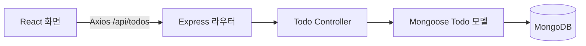

# Focus Todos

**할 일 추가·완료 처리·삭제를 구현한 개인 풀스택 CRUD 및 배포 실습입니다.**

React 화면에서 Express API를 호출하고, MongoDB에 할 일을 저장합니다. Antigravity AI 에이전트를 활용해 요구사항 작성부터 구현·배포까지 진행한 프로젝트입니다.

[배포 앱 열기](https://full-stack-crud-app-deployment.vercel.app/) · [초기 요구사항](docs/project-brief.md) · [구조와 구현 정리](result.md)

`React 18` · `Vite 5` · `Tailwind CSS 3` · `Express 4` · `MongoDB / Mongoose`

## 동작 미리보기


> 로컬에서 저장소의 프론트엔드·백엔드와 임시 MongoDB를 실행해 캡처했습니다. 할 일 추가 → 완료 처리 → 삭제 흐름이며, 배포 앱과 같은 소스입니다.

## 주요 기능

| 기능 | 구현 내용 |
| --- | --- |
| 할 일 추가 | 제목을 입력하면 새 항목을 저장하고 목록 상단에 표시 |
| 목록 조회 | 저장된 할 일을 생성 시각 역순으로 조회 |
| 완료 처리 | 항목을 눌러 완료 상태 전환, 체크 표시·취소선 반영 |
| 삭제 | 삭제 버튼으로 해당 항목 제거 |
| 배포 | Vercel에서 정적 프론트엔드와 `/api/*` 백엔드 라우팅 |

## 요청 흐름



## 로컬 실행

Node.js와 접근 가능한 MongoDB가 필요합니다. 두 터미널에서 백엔드와 프론트엔드를 각각 실행합니다.

### 1. 백엔드

```bash
git clone https://github.com/unknownamed/Full-stack-CRUD-App-Deployment.git
cd Full-stack-CRUD-App-Deployment/backend
npm ci
```

`backend/.env`를 만들고 **자신의 DB 연결 주소**를 설정합니다.

```dotenv
MONGODB_URI=mongodb://127.0.0.1:27017/focus_todos
PORT=5000
```

```bash
npm run dev
```

### 2. 프론트엔드

```bash
cd Full-stack-CRUD-App-Deployment/frontend
npm ci
npm run dev
```

표시된 개발 서버 주소를 엽니다. 기본 주소는 `http://localhost:5173`이며, 로컬 프론트엔드는 `http://localhost:5000/api/todos`를 호출합니다.

## API

| 메서드 | 경로 | 내용 |
| --- | --- | --- |
| GET | `/api/todos` | 전체 목록 |
| POST | `/api/todos` | `{ "title": "할 일" }`로 생성, 성공 시 201 |
| PUT | `/api/todos/:id` | `{ "completed": true }`로 완료 상태 변경 |
| DELETE | `/api/todos/:id` | 항목 삭제 |

현재 수정 API는 **완료 상태만 변경**합니다. 제목 수정·사용자별 목록·로그인 기능은 구현되어 있지 않습니다.

## 코드 살펴보기

- [화면과 상태 관리](frontend/src/App.jsx): 조회·추가·완료·삭제 요청과 UI
- [API 진입점](backend/index.js): Express 설정과 라우팅
- [Todo 라우터](backend/routes/todoRoutes.js) / [컨트롤러](backend/controllers/todoController.js)
- [데이터 모델](backend/models/Todo.js): 제목, 완료 여부, 생성·수정 시각
- [배포 설정](vercel.json): 프론트엔드와 API 경로 연결
