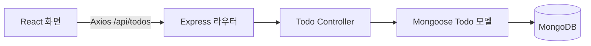

<a id="project-overview-added"></a>

[프로젝트 안내](#project-overview-added) · [기존 README 전체 내용](#original-readme-preserved)

# Focus Todos

**할 일 추가·완료 처리·삭제를 구현한 개인 풀스택 CRUD 및 배포 실습입니다.**

React 화면에서 Express API를 호출하고, MongoDB에 할 일을 저장합니다. Antigravity AI 에이전트를 활용해 요구사항 작성부터 구현·배포까지 진행한 프로젝트입니다.

[배포 앱 열기](https://full-stack-crud-app-deployment.vercel.app/) · [초기 요구사항](#original-readme-preserved) · [구조와 구현 정리](result.md)

`React 18` · `Vite 5` · `Tailwind CSS 3` · `Express 4` · `MongoDB / Mongoose`

## 동작 미리보기


> 로컬에서 저장소의 프론트엔드·백엔드와 임시 MongoDB를 실행해 캡처했습니다. 할 일 추가 → 완료 처리 → 삭제 흐름이며, 배포 앱과 같은 소스입니다.

## 주요 기능

| 기능 | 구현 내용 |
| --- | --- |
| 할 일 추가 | 제목을 입력하면 새 항목을 저장하고 목록 상단에 표시 |
| 목록 조회 | 저장된 할 일을 생성 시각 역순으로 조회 |
| 완료 처리 | 항목을 눌러 완료 상태 전환, 체크 표시·취소선 반영 |
| 삭제 | 삭제 버튼으로 해당 항목 제거 |
| 배포 | Vercel에서 정적 프론트엔드와 `/api/*` 백엔드 라우팅 |

## 요청 흐름



## 로컬 실행

Node.js와 접근 가능한 MongoDB가 필요합니다. 두 터미널에서 백엔드와 프론트엔드를 각각 실행합니다.

### 1. 백엔드

```bash
git clone https://github.com/unknownamed/Full-stack-CRUD-App-Deployment.git
cd Full-stack-CRUD-App-Deployment/backend
npm ci
```

`backend/.env`를 만들고 **자신의 DB 연결 주소**를 설정합니다.

```dotenv
MONGODB_URI=mongodb://127.0.0.1:27017/focus_todos
PORT=5000
```

```bash
npm run dev
```

### 2. 프론트엔드

```bash
cd Full-stack-CRUD-App-Deployment/frontend
npm ci
npm run dev
```

표시된 개발 서버 주소를 엽니다. 기본 주소는 `http://localhost:5173`이며, 로컬 프론트엔드는 `http://localhost:5000/api/todos`를 호출합니다.

## API

| 메서드 | 경로 | 내용 |
| --- | --- | --- |
| GET | `/api/todos` | 전체 목록 |
| POST | `/api/todos` | `{ "title": "할 일" }`로 생성, 성공 시 201 |
| PUT | `/api/todos/:id` | `{ "completed": true }`로 완료 상태 변경 |
| DELETE | `/api/todos/:id` | 항목 삭제 |

현재 수정 API는 **완료 상태만 변경**합니다. 제목 수정·사용자별 목록·로그인 기능은 구현되어 있지 않습니다.

## 코드 살펴보기

- [화면과 상태 관리](frontend/src/App.jsx): 조회·추가·완료·삭제 요청과 UI
- [API 진입점](backend/index.js): Express 설정과 라우팅
- [Todo 라우터](backend/routes/todoRoutes.js) / [컨트롤러](backend/controllers/todoController.js)
- [데이터 모델](backend/models/Todo.js): 제목, 완료 여부, 생성·수정 시각
- [배포 설정](vercel.json): 프론트엔드와 API 경로 연결

---

<a id="original-readme-preserved"></a>

## 기존 README 전체 내용

# Full-stack-CRUD-App-Deployment
This is a full-stack To-do List app project developed for a Software Engineering course.
# 프로젝트 지시사항
# 미니 프로젝트: 풀스택 Todo 리스트 앱 만들기 & Vercel 배포

**목표**  
- 프론트엔드(React + Vite), 백엔드(Express), 데이터베이스(MongoDB Atlas)를 모두 연결한 Todo 앱을 만들어 보세요.  
- 소프트웨어공학 프로세스(요구사항 → 구현 → 테스팅 → 배포)를 미리 맛보기
- 생성형 AI(ChatGPT, Gemini, Grok, Claude Code)를 적극 활용해 코드 작성/디버깅 연습  

**마감 일자**: 4월 10일 금요일 (3주)  
**난이도**: 초중급 (기본 JavaScript/HTML/CSS 알면 충분)  
**평가**: 배포 성공 + 기본 CRUD 동작 + GitHub 레포 + 간단 문서

### 1. 프로젝트 요구사항 (최소 기능 – MVP)
- Todo 항목 추가 (제목 입력)
- Todo 목록 보기
- Todo 완료 체크 (체크박스)
- Todo 삭제

### 2. 추천 기술 스택 (왜 이걸 쓰나요?)
- **Frontend**: React + Vite (빠르고 현대적, CRA보다 훨씬 빠름)
- **Backend**: Node.js + Express (간단 REST API)
- **Database**: MongoDB Atlas (무료 클라우드 DB, 연결 쉬움)
- **배포**: Vercel (프론트 + 백엔드 모두 지원, GitHub 연동 자동 배포)
- **스타일링**: Tailwind CSS 또는 기본 CSS (시간 절약용)
- **HTTP 클라이언트**: Axios 또는 fetch

### 3. 단계별 구현 가이드

#### Step 0: 사전 준비
1. **필수 설치 확인**
   - Node.js 18 이상 (https://nodejs.org)
   - Git 설치 및 GitHub 계정
   - Vercel 계정 (https://vercel.com/signup – GitHub 연동 추천)
   - MongoDB Atlas 계정 (https://www.mongodb.com/cloud/atlas/register)

2. **새 GitHub 레포지토리 생성**
   - 이름 예: `todo-app-mini-project-학번`
   - Public으로 만들고 README.md 초기 커밋

3. **프로젝트 폴더 구조 예시** (monorepo 방식 추천 – Vercel에서 편함)
   ```
   todo-app/
   ├── frontend/          # React + Vite
   ├── backend/           # Express API
   ├── .gitignore
   └── README.md
   ```

#### Step 1: MongoDB Atlas 세팅
1. Atlas 대시보드 → 새 클러스터 생성 (무료 M0 tier)
2. Database Access → 새 사용자 생성 (username/password 기억)
3. Network Access → IP 주소 0.0.0.0/0 허용 (테스트용 – 나중에 제한 가능)
4. Connect → Drivers → Node.js 선택 → 연결 문자열 복사  
   예: `mongodb+srv://<user>:<pass>@cluster0.abcde.mongodb.net/todoDB?retryWrites=true&w=majority`

#### Step 2: 백엔드 만들기
1. backend 폴더로 이동 → `npm init -y`
2. 패키지 설치:
   ```
   npm install express mongoose cors dotenv
   npm install -D nodemon
   ```
3. `.env` 파일 생성 (gitignore에 추가!)
   ```
   PORT=5000
   MONGODB_URI=위에서 복사한 연결 문자열
   ```
4. `index.js` (또는 server.js) 작성:
   ```js
   require('dotenv').config();
   const express = require('express');
   const mongoose = require('mongoose');
   const cors = require('cors');

   const app = express();
   app.use(cors());
   app.use(express.json());

   mongoose.connect(process.env.MONGODB_URI)
     .then(() => console.log('MongoDB 연결 성공'))
     .catch(err => console.log(err));

   // Todo 스키마
   const todoSchema = new mongoose.Schema({
     title: { type: String, required: true },
     completed: { type: Boolean, default: false }
   });
   const Todo = mongoose.model('Todo', todoSchema);

   // API 엔드포인트
   app.get('/api/todos', async (req, res) => {
     const todos = await Todo.find();
     res.json(todos);
   });

   app.post('/api/todos', async (req, res) => {
     const newTodo = new Todo({ title: req.body.title });
     await newTodo.save();
     res.json(newTodo);
   });

   app.put('/api/todos/:id', async (req, res) => {
     const todo = await Todo.findByIdAndUpdate(req.params.id, { completed: req.body.completed }, { new: true });
     res.json(todo);
   });

   app.delete('/api/todos/:id', async (req, res) => {
     await Todo.findByIdAndDelete(req.params.id);
     res.json({ message: '삭제 완료' });
   });

   const PORT = process.env.PORT || 5000;
   app.listen(PORT, () => console.log(`서버 실행 중: http://localhost:${PORT}`));
   ```
5. `package.json`에 스크립트 추가:
   ```json
   "scripts": {
     "start": "node index.js",
     "dev": "nodemon index.js"
   }
   ```
6. `npm run dev`로 로컬 테스트 (Postman으로 API 확인)

**Vercel 배포용 준비** (중요!)
- `api/` 폴더로 옮기거나, vercel.json 생성 (serverless 함수용):
  ```json
  {
    "version": 2,
    "builds": [
      { "src": "backend/index.js", "use": "@vercel/node" }
    ],
    "routes": [
      { "src": "/api/(.*)", "dest": "backend/index.js" },
      { "src": "/(.*)", "dest": "/" }
    ]
  }
  ```
- Express를 serverless로 변환: `module.exports = app;` 추가 (app.listen 제거 또는 조건부)

#### Step 3: 프론트엔드 만들기
1. 루트에서:
   ```
   npm create vite@latest frontend -- --template react
   cd frontend
   npm install
   npm install axios tailwindcss postcss autoprefixer -D
   npx tailwindcss init -p
   ```
2. Tailwind 설정
3. `src/App.jsx`에 Todo UI 구현 (axios로 백엔드 호출)
   - GET /api/todos 로 목록 불러오기
   - POST /api/todos 로 추가
   - PUT /api/todos/:id 로 체크
   - DELETE /api/todos/:id 로 삭제

#### Step 4: 연결 & 로컬 테스트
- backend: `npm run dev`
- frontend: `npm run dev` → http://localhost:5173
- 프론트에서 백엔드 주소: `http://localhost:5000/api/todos`

#### Step 5: GitHub Push & Vercel 배포
1. 전체 프로젝트 push
2. https://vercel.com → New Project → GitHub Import
3. 프로젝트 루트 설정 (frontend 또는 전체 monorepo)
4. Environment Variables: MONGODB_URI 추가
5. Deploy → 성공 시 URL 발급 (예: https://todo-app-학번.vercel.app)

### 4. 자주 발생하는 에러 & 해결
- MongoDB 연결 실패 → IP 허용 확인, URI 오타
- Vercel 배포 실패 → vercel.json 확인, api 폴더 구조 맞춤
- CORS 에러 → backend에 cors() 미들웨어 확인
- "Backend not running" → Express를 serverless handler로 export

### 5. 제출물 (마감: 4월 10일)
- GitHub 레포지토리 URL
- Vercel 배포 URL (작동 확인)
- 간단 보고서 (5페이지 이내): 
  - 어려웠던 점 / AI 어떻게 썼나 / 배운 점
